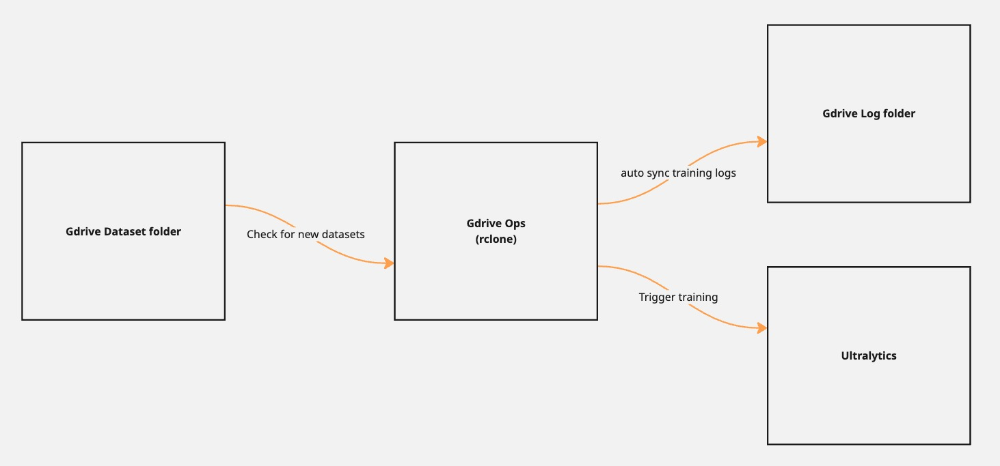

# Ultralytics Google Drive Training Manager

This service automates the process of training Ultralytics YOLO models using datasets stored in Google Drive. It continuously monitors a specified Google Drive folder for new datasets, downloads them, initiates training, and syncs the training results back to Google Drive.



## How It Works

1. **Monitoring**: Continuously checks a designated Google Drive folder for new datasets
2. **Download**: When a new dataset is detected, it's downloaded to the local machine
3. **Training**: Automatically starts YOLO training on the downloaded dataset
4. **Synchronization**: Training results and model logs are synced back to Google Drive in real-time
5. **Simultaneous Training**: It can run multiple training processes simultaneously, but only on different GPUs

## Prerequisites

- Python 3.10+
- rclone configured with Google Drive access
- Ultralytics installed
- ONNX in order to export trained models to ONNX format

## Installation

1. Clone this repository:
   ```bash
   git clone https://github.com/santapo/ultralytics-gdrive-ops.git
   cd ultralytics-gdrive-ops
   ```

2. Install the required dependencies:
   ```bash
   pip install -r requirements.txt
   ```

3. Configure rclone for Google Drive access:
   ```bash
   rclone config
   ```

## Dataset Structure

The training manager expects datasets in a specific structure:

1. Create a ZIP file containing your dataset with the following structure:
   ```
   dataset_name/
   ├── train/
   │   ├── images/
   │   │   ├── image1.jpg
   │   │   ├── image2.jpg
   │   │   └── ...
   │   └── labels/
   │       ├── image1.txt
   │       ├── image2.txt
   │       └── ...
   └── val/
   │   ├── images/
   │   │   ├── image1.jpg
   │   │   ├── image2.jpg
   │   │   └── ...
   │   └── labels/
   │       ├── image1.txt
   │       ├── image2.txt
   │       └── ...
   ├── labels.txt
   ├── data.yaml
   └── training_config.yaml
   ```

2. Ensure your label files follow the YOLOv8 format:
   ```
   class_id x_center y_center width height
   ```
   Where all values are normalized between 0 and 1.

3. The training config file should be a YAML file with the following structure:

```yaml
model: yolov8x.pt # can be a ultralytics pretrained model or your own model checkpoints stored in gdrive_pretrained_model_path
epochs: 100
batch: 16
... # other training parameters that ultralytics supports
```

## Usage

Run the training manager with the following command:
```
bash run.sh
```

To tracking trainings with Weight & Bias:
```
export WANDB_API_KEY=<your_wandb_api_key>

yolo settings wandb=true # to ensure wandb is enabled
```